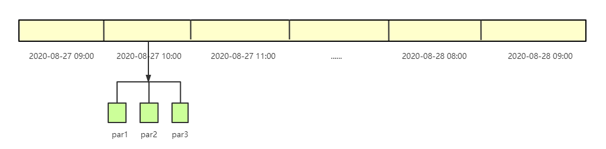

# JAVA DB概要设计

## 需求

支持接入时序的结构化数据.

支持建数据源,建表.

支持物化视图(离线rollup)

支持SQL语法

支持JDBC协议

## 程序要求

java语言开发,可以跨平台运行.

外部依赖尽可能少

部署和运维简单

## 功能模块

元信息管理模块

数据接入模块

离线任务模块(文件合并)

索引模块

文件系统模块(副本维护)

查询引擎模块

服务器模块

客户端

数据迁移模块

## 概要设计

### 元信息管理模块

支持以下元信息的增删改查, 可以借助于[Derby](http://db.apache.org/derby)

#### 用户可以操作

支持管理员用户, 即安装系统的用户

管理员用户可以创建用户, 设置用户密码, 设置用户权限(数据源权限)

用户可以创建,修改,更新数据源, 数据源下面可以创建表, 表下面可以创建字段.

#### 系统产生的

系统文件路径信息: 包括文件属性, 副本信息, 被哪些节点持有等.

监控信息: 数据写入速度, 各节点状态, 查询信息等.

#### 主从同步

集群默认下实现主从同步功能.

### 数据接入模块

#### WAL

利用WAL方式保证数据在本机不会丢失.

#### LSM-tree

使用日志合并树完成数据的索引构建.

#### 内存控制

控制时间,大小的方式控制内存, 保证内存在安全的范围使用内.

#### 副本同步设计

主从同步机制保证个别机器宕机不会影响数据的完整性.

### 离线任务模块

#### 物化视图

根据规则计算大粒度数据.

#### 合并文件

按照规则自动合并小文件,使文件一直处于高效使用状态, 减少文件个数

### 索引模块

所有数据文件按照数据条数+时段划分.

#### 内存形式数据结构

内存数据以二维表形式存储, 索引使用map+bitmap

#### 文件形式数据结构

##### 默认时间排序

在同一文件中数据按照时间排序, 有利于时间筛选.

##### 倒排索引

使用有序数组, FST实现字典, 使用位图存储行信息.

##### 列存储

按列压缩, 为向量化优化提供条件.

### 文件系统模块

#### 文件存储方式

数据按时间划分, 同一时段下面包含一个子分区,分区下面是文件. 

#### 文件副本

支持文件副本同步.

#### 文件清理

提供文件清理规则.

### 查询引擎模块

#### 语法解析

初步使用Apache Calcite作为语法解析与优化工具.

#### 并行执行(分布式)

查询语句可以按照规则并行执行(按时间段划分)

#### 提供向量化计算优化

指标聚合可以考虑使用向量化计算.

#### 提供物化视图优化

假设数据源设置了none粒度, 小时粒度. 按照小时粒度查询时可以优先查询小时表.

### 服务器模块

使用jetty作为网络通信工具. 支持Http和JDBC协议.

### 客户端

支持JDBC协议. 支持单条数据插入和批量数据插入, 支持查询功能.

### 数据迁移模块

支持数据迁移到其它系统, 从其它系统迁移到本系统.